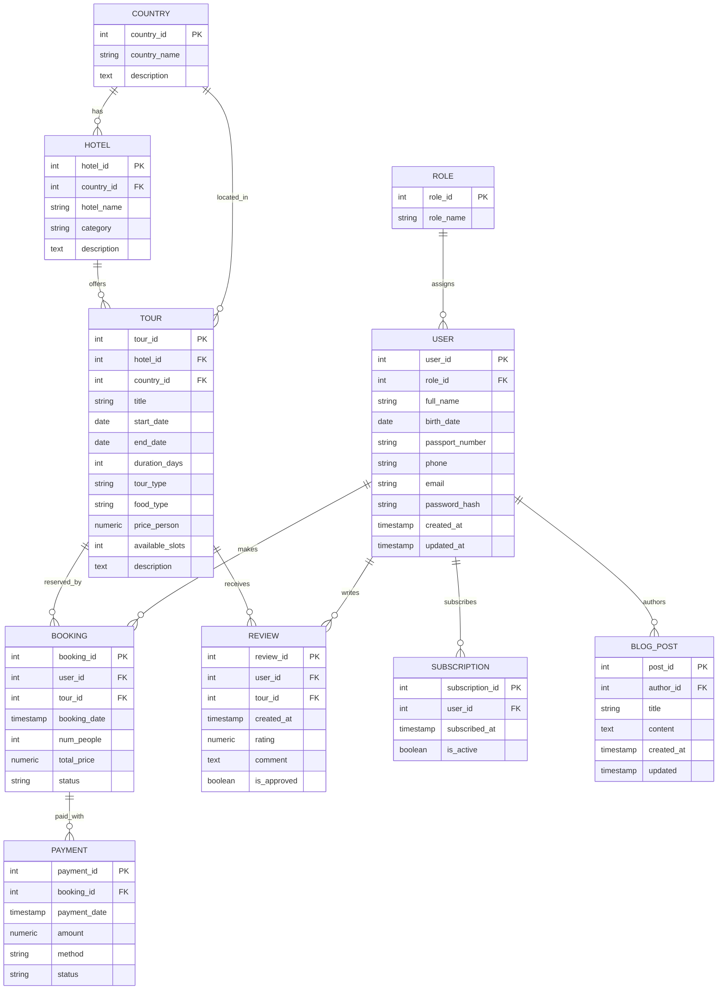

# Техническое задание

## Система управления туристического агенства

### Введение

**Общие сведения**  
Проект: Веб-сайт туристического агентства "Путешествия без границ"  
Цель: Создание современного, функционального сайта для продажи туров и туристических услуг

### Функционал

**Типы пользователей:**

- **Гость:**

  - Просмотр каталога туров
  - Поиск и фильтрация туров
  - Просмотр информации о странах и отелях
  - Чтение отзывов и блога
  - Регистрация и вход в систему

- **Пользователь:**

  - Все права гостя
  - Бронирование туров
  - Оплата онлайн
  - Управление своими бронированиями
  - Написание отзывов
  - Сохранение избранных туров
  - Подписка на рассылку
  - Редактирование личного профиля

- **Менеджер:**

  - Просмотр и управление заявками клиентов
  - Консультирование клиентов через чат
  - Просмотр аналитики продаж
  - Управление контентом сайта
  - Добавление/редактирование туров
  - Управление описаниями отелей и стран
  - Публикация статей в блог
  - Модерация отзывов
  - Обновление фотогалерей

- **Админ:**
  - Полный доступ ко всем функциям
  - Управление пользователями и ролями
  - Настройка системы
  - Просмотр финансовой отчетности
  - Управление интеграциями
  - Настройка платежных систем

**Интересные фичи:**

- Смена языков (ru, en, es) [next-intl]
- Изменение тем (темная, светлая) [next-themes]

## Структура и контент

### Управление турами и направлениями

Сначала администратор добавляет новые туры в систему, вводя информацию о каждом туре, включая: название тура, страну и город назначения, курорт/отель, даты заезда/выезда, продолжительность, тип тура (пляжный, экскурсионный, горнолыжный и т.д.), категорию отеля, тип питания, цену, описание, включенные и невключенные услуги, а также количество доступных мест. Эта информация хранится в базе данных и обновляется по мере необходимости.

В случае бронирования тура, менеджер регистрирует продажу в системе, что автоматически уменьшает количество доступных мест на забронированное количество.

Администраторы могут добавлять новых партнеров и поставщиков услуг (отели, авиакомпании, трансферы), обновлять их контактные данные и условия сотрудничества. При получении новой квоты мест от партнера, администратор регистрирует поступление в систему, указывая дату, количество мест и другие детали. Это приводит к обновлению количества доступных мест по соответствующим турам.

Для каждого тура ведется учет в двух измерениях: количество мест и общая стоимость пакета. Система автоматически рассчитывает стоимость в зависимости от количества человек и выбранных опций.

Система позволяет генерировать отчеты о текущей доступности туров, загрузке направлений и других ключевых показателях.

### Управление продажами и бронированиями

Менеджер регистрирует каждую продажу в системе, вводя информацию о забронированном туре, количестве туристов, общей стоимости бронирования, а также данные о клиенте, если он зарегистрирован в системе.

При регистрации бронирования система автоматически обновляет количество доступных мест по туру. Каждая продажа фиксируется с указанием даты и времени бронирования.

### Взаимодействие с клиентами

Клиенты могут регистрироваться в системе, предоставляя свои персональные данные, включая: ФИО, дату рождения, номер паспорта, контактный телефон и электронную почту.

Вход в систему происходит через код подтверждения по email или SMS.

Администраторы могут просматривать, редактировать и управлять профилями клиентов. В системе ведется полная история бронирований и взаимодействий каждого клиента.

Система поддерживает отправку автоматических уведомлений и напоминаний. Клиенты получают информацию о специальных предложениях, новых направлениях, а также напоминания о предстоящих поездках и необходимых документах.

### Бронирование туров

Клиенты могут выбирать туры для бронирования через интерфейс системы, указывая необходимые параметры: даты поездки, количество человек, тип номера и дополнительные услуги.

В интерфейсе менеджера отображается информация о всех активных бронированиях и их статусах.

Клиенты получают автоматические напоминания об окончании срока бронирования и необходимости подтверждения или оплаты.

В случае отмены бронирования количество доступных мест автоматически восстанавливается в системе.

# Технологические требования

## Deploy

- Docker

## Frontend

- Фреймворк: Next.js
- Язык: TypeScript
- State management: Zustand
- Маршрутизация: React Router
- Вспомогательные библиотеки:
  - lucide icons
  - zod
  - framer-motion

## Backend

- Nest.js
- ORM: Prisma

## Database

- PostgreSQL

# ER-диаграмма

